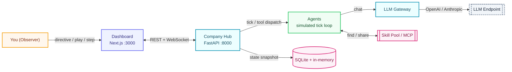

# ai-sim-company

> Multi-agent AI company simulation. Configure a business, and a CEO (LLM-driven) autonomously runs it — hiring, delegating, meeting, producing — while you watch on a real-time dashboard.

<p align="center">
  
  
  
  
  
  
  
  
</p>

<p align="center">
  <a href="#-quick-start"><b>🚀 Quick Start</b></a> ·
  <a href="#-features"><b>🧩 Features</b></a> ·
  <a href="#-how-it-works"><b>🧭 How It Works</b></a> ·
  <a href="#-commands"><b>📋 Commands</b></a> ·
  <a href="#-roadmap"><b>🎯 Roadmap</b></a> ·
  <a href="#-configuration"><b>🔧 Configuration</b></a> ·
  <a href="./README.zh-CN.md">🌏 中文</a>
</p>

---

> Most agent demos let you watch a simulation play out. **ai-sim-company gives you the controls.**
>
> Pause the clock, step a single tick, steer the CEO with a directive, and watch a self-organizing company form from nothing but a business description — all from one console.

## ✨ Highlights

<table>
<tr>
  <td align="center" width="33%">🧠<br/><b>CEO runs itself</b><br/><sub>An LLM-driven CEO hires, delegates, and sets strategy. You only observe.</sub></td>
  <td align="center" width="33%">🏢<br/><b>Self-organizing org</b><br/><sub>CEO → HR → Product Manager → engineers/designers, grown from your business description.</sub></td>
  <td align="center" width="33%">🔧<br/><b>Real tool calls</b><br/><sub>Agents act each tick via hiring, messaging, tasks, meetings, files, code review, MCP.</sub></td>
</tr>
<tr>
  <td align="center" width="33%">📡<br/><b>Real-time dashboard</b><br/><sub>Play / step, filterable logs, tasks, agents, cash flow — streamed over WebSocket.</sub></td>
  <td align="center" width="33%">🔌<br/><b>Skills &amp; MCP</b><br/><sub>Hub-side skill pool (share/scope/version) + external MCP servers for every agent.</sub></td>
  <td align="center" width="33%">💸<br/><b>Cost control</b><br/><sub>Daily token budget, RPM cap, think-every-N-ticks; OpenAI &amp; Anthropic supported.</sub></td>
</tr>
</table>

## 🚀 Quick Start

Requires **Python 3.12+** and **Node 18+** (`npx`/`uvx` optional, for MCP servers).

```bat
init.bat                         :: checks Python/Node/MCP tools, installs deps, builds frontend
copy .env.example .env           :: fill in LLM_API_KEY (+ optional LLM_MODEL / LLM_BASE_URL)
start.bat                        :: start backend (:8000) + frontend (:3000)
```

Open http://localhost:3000:

1. **/setup** — configure the business (name, description, capital, monthly budget, workspace dir) → **Apply** (resets the simulation, re-seeds the CEO).
2. **Console (/)** — ▶ **Play** / ⏭ **Step**, watch logs (filterable), tasks, agent panel. Use **📢 CEO Directive** to send instructions to the CEO.

Any OpenAI-compatible endpoint or the Anthropic native API works. The LLM API key is configured once; agents never see it.

## 🧩 Features

|     | Feature | What you get |
| --- | --- | --- |
| 🚀 | **`/setup` hot-reload** | Business config (name / description / capital / budget / workspace). Apply stops the sim, clears state, and re-seeds the CEO with your description injected into its tick prompt. |
| 🎛️ | **Console** | ▶ Play / ⏭ Step, filterable logs, task board, agent panel. Send 📢 CEO directives that take effect next tick. |
| 👥 | **`/agents`** | View the team, hire agents, click into per-agent detail. |
| 🧩 | **`/skills`** | Create / paste JSON / install from URL / upload `.zip` (SKILL.md + .py). Edit / delete. Agents inherit skills and can find / create / share them. |
| 🔌 | **`/mcp`** | Configure external MCP servers (stdio / sse / streamableHttp). Their tools become available to all agents. |
| 📁 | **`/files`** | Browse the shared workspace (agent-produced code / docs / assets). |
| 📊 | **`/dashboard`** | Cash flow, LLM usage, team, project board. |
| ⚙️ | **`/settings`** | LLM config (read-only), Claude Code enable toggle. |
| 💬 | **Communication** | DM (1:1), Channel (1:N), Meeting (N:N, LLM-hosted), Announcement (1:All) — one `Message` schema. |
| 🧠 | **Agent lifecycle** | `booting → initializing → running → offline`. Profile (role/personality/tools) is runtime-defined, never hardcoded. |
| 🌐 | **Multi-provider LLM** | OpenAI-compatible (OpenAI / DeepSeek / Zhipu / Moonshot / Qwen / OpenRouter / one-api) + Anthropic native, with budget & RPM caps. |

## 👥 How the company runs

You set the business (name / description / budget). A CEO agent then runs the company autonomously via an LLM:

- **CEO** hires an HR Director, then focuses on strategy and delegation.
- **HR** hires a Product Manager first.
- **PM** analyzes the business and tells HR what roles the product needs (e.g. "2 senior engineers, 1 designer").
- **HR** hires per the PM's requests.
- **Engineers / Designers** pick up tasks, produce files (code / docs / assets) in a shared workspace, verify with tests/reviews, then mark work done.
- Everyone communicates via messages and meetings; the simulation clock advances; the dashboard shows it live.

Agents make real decisions by calling tools each tick: `create_agent` · `send_message` · `create_task` · `complete_task` · `call_meeting` · `write_file` · `run_claude_code` · `code_review` · `web_search` · `find_skill` / `create_skill` / `share_skill` / `learn_skill` · `mcp_*`. You're an observer — you don't control agents directly, but you can send the CEO a directive from the console at any time.

## 🧭 How It Works



ai-sim-company is **local-first**: the dashboard, Hub, agent loop, skill pool, and state all run on your machine. The LLM endpoint is the only external service you choose. The Hub orchestrates but **never decides for agents** — every decision comes from an LLM call.

| Layer | What it does |
| --- | --- |
| 🖥️ **Dashboard** | Next.js + React multi-route UI: console, tasks, logs, agents, skills, MCP, files, dashboard, settings. |
| 🏢 **Company Hub** | FastAPI service: REST + WebSocket API, simulation clock, economy, orchestration, profile generation, LLM gateway, skill pool, message routing. |
| 🤖 **Agent Runner** | In-process simulated tick loop. Each agent thinks via the LLM and calls tools. (No containers.) |
| 🔑 **LLM Gateway** | Single config point for the API key; role→model routing; OpenAI/Anthropic wire conversion; daily budget & RPM caps. |
| 🧩 **Skill Pool + MCP** | Hub-side skill sharing / scoping / versioning; external MCP servers expose tools to all agents. |
| 💾 **Storage** | SQLite (agents / profiles / tasks / skills / hub state) + in-memory. No Redis, no containers. |

## 📋 Commands

```bat
init.bat                         :: checks Python/Node/MCP tools, installs deps, builds frontend
start.bat                        :: start backend (:8000) + frontend (:3000)
stop.bat                         :: stop services by port (8000 / 3000-3002)
reset.bat                        :: stop + clear SQLite + frontend .next cache
```

Dev / tests:

```bat
pytest                           :: backend tests
ruff check aisim tests
mypy aisim
cd frontend && npx tsc --noEmit  :: frontend type check
cd frontend && npm run dev
```

## 🎯 Roadmap

### ✅ Done

- [x] **Simulated agent backend** — Hub runs the tick loop directly; no containers, no Redis.
- [x] **Multi-route data dashboard** — console / tasks / logs / agents / skills / mcp / files / dashboard / settings.
- [x] **`/setup` hot-reload** — business description + budget injected into the CEO's tick prompt.
- [x] **Hub-side Skill Pool** — share / scope / version / lifecycle.
- [x] **External MCP servers** — stdio / sse / streamableHttp; tools available to all agents.
- [x] **Multi-provider LLM gateway** — OpenAI-compatible + Anthropic, with budget & RPM caps.
- [x] **Real agent tools** — hiring, messaging, tasks, meetings, files, code review, Claude Code.

### 🧭 Planned (design-target, not yet in local mode)

- [ ] **Containerized per-agent runtime** — each agent in its own Docker container (Hermes); local mode is simulated in-process today.
- [ ] **Agent-side skill auto-extraction** — Hermes-side learning; only the Hub-side pool exists today.
- [ ] **Object storage for file tools** — MinIO/S3 adapter; `file_ops` is a local stub today.

## 🔧 Configuration

### `.env` (environment variables)

Copy `.env.example` to `.env` and fill in. The backend auto-loads it on startup. These vars are referenced by `config/company.yaml` via `${VAR}` placeholders.

| Variable | Required | Default | Description |
|---|---|---|---|
| `LLM_API_KEY` | yes | - | LLM API key (configured once; agents never see it). |
| `LLM_PROVIDER` | no | `openai` | Interface type: `openai` (OpenAI-compatible `/chat/completions`) or `anthropic` (native `/v1/messages`). |
| `LLM_MODEL` | no | `gpt-4o-mini` | Default model for all agents. |
| `LLM_BASE_URL` | no | (official OpenAI) | OpenAI-compatible endpoint. DeepSeek: `https://api.deepseek.com/v1`; Zhipu: `https://open.bigmodel.cn/api/paas/v4`; one-api: `http://localhost:3000/v1`. |
| `LLM_TOOLS_ENABLED` | no | `true` | Enable function-calling (agent tools). `false` if the endpoint doesn't support tools (agents still think, plain text). |
| `LLM_MAX_ITERS` | no | `3` | Max LLM↔tool loop rounds per agent per tick. `1` = cheapest; `3` = can chain multiple tools. |
| `LLM_DAILY_BUDGET` | no | `2000000` | Daily token budget (cost cap). `0` / negative = unlimited. |
| `LLM_RPM_LIMIT` | no | `0` | Requests-per-minute cap. `0` = unlimited. Set to match your API key's rate limit to avoid 429s. |
| `TICK_INTERVAL_MS` | no | `5000` | Simulation tick interval (ms). Larger = slower clock, less LLM cost. |
| `SIM_AUTO_START` | no | `false` | `true` = auto-run on startup; `false` = paused (manual Play). |
| `AGENT_THINK_EVERY` | no | `1` | Agent thinks once every N ticks. `1` = every tick; larger saves cost. |
| `AGENT_STEP_DELAY_MS` | no | `800` | Interval between agents in step mode (ms). |

#### LLM interface

Two interface types are supported, selected by `LLM_PROVIDER`:

- **`openai`** (default) — OpenAI-compatible `/chat/completions`. Works with OpenAI, DeepSeek, Zhipu, Moonshot, Qwen, one-api/new-api proxies, OpenRouter, etc. Set `LLM_BASE_URL` to the endpoint.
- **`anthropic`** — Anthropic native `/v1/messages`. Direct connection to Claude official API (`api.anthropic.com`). Leave `LLM_BASE_URL` empty.

The system uses OpenAI message format internally; when `anthropic` is selected, messages/tools are converted automatically on the wire.

**DeepSeek example:**
```
LLM_API_KEY=sk-...
LLM_MODEL=deepseek-v4-flash
LLM_BASE_URL=https://api.deepseek.com/v1
LLM_PROVIDER=openai
LLM_RPM_LIMIT=60
```

**Anthropic (Claude) example:**
```
LLM_API_KEY=sk-ant-...
LLM_MODEL=claude-sonnet-5
LLM_PROVIDER=anthropic
LLM_BASE_URL=
```

### `config/company.yaml`

Business (name / description / budget / workspace_dir), CEO, LLM routing, MCP servers. The `/setup` page writes the `company` section; MCP servers are managed on `/mcp`.

## 🤝 Contributing

Issues and pull requests are welcome. To set up a dev environment:

```bat
init.bat
pytest
cd frontend && npm run dev
```

Code, identifiers, comments, and commit messages are **English**. Before changing agent behavior, read `aisim/company/agent_runner.py` (`_build_prompt` / `_directive`) and the relevant `aisim/llm/prompts/*.j2` template. The LLM API key never goes in the frontend or agent-visible config.
