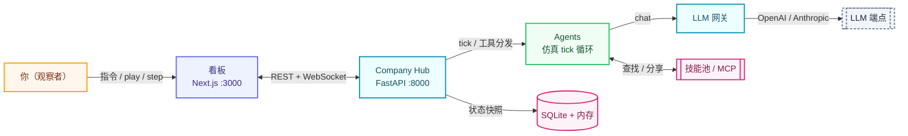

# ai-sim-company

> 多智能体 AI 公司模拟。配置业务，CEO（LLM 驱动）自主经营--招聘、派活、开会、产出--实时看板观察。

<p align="center">
  
  
  
  
  
  
  
  
</p>

<p align="center">
  <a href="#-快速开始"><b>🚀 快速开始</b></a> ·
  <a href="#-功能"><b>🧩 功能</b></a> ·
  <a href="#-工作原理"><b>🧭 工作原理</b></a> ·
  <a href="#-命令"><b>📋 命令</b></a> ·
  <a href="#-路线图"><b>🎯 路线图</b></a> ·
  <a href="#-配置"><b>🔧 配置</b></a> ·
  <a href="./README.md">🌏 English</a>
</p>

---

> 多数 agent 演示只能让你旁观。**ai-sim-company 把控制权交给你。**
>
> 暂停时钟、单步推进、用指令引导 CEO，从一个业务描述出发，看一家自组织公司从无到有--全在一个主控台完成。

## ✨ 亮点

<table>
<tr>
  <td align="center" width="33%">🧠<br/><b>CEO 自主经营</b><br/><sub>LLM 驱动的 CEO 招聘、委派、定战略，你只观察。</sub></td>
  <td align="center" width="33%">🏢<br/><b>自组织团队</b><br/><sub>CEO -> HR -> 产品经理 -> 工程师/设计师，由你的业务描述生长出来。</sub></td>
  <td align="center" width="33%">🔧<br/><b>真实工具调用</b><br/><sub>Agent 每 tick 调用招聘、消息、任务、会议、文件、代码审查、MCP。</sub></td>
</tr>
<tr>
  <td align="center" width="33%">📡<br/><b>实时看板</b><br/><sub>Play / Step、可过滤日志、任务、现金流，WebSocket 实时推送。</sub></td>
  <td align="center" width="33%">🔌<br/><b>技能与 MCP</b><br/><sub>Hub 侧技能池（分享/作用域/版本）+ 外部 MCP server 供全员使用。</sub></td>
  <td align="center" width="33%">💸<br/><b>成本可控</b><br/><sub>每日 token 预算、RPM 限速、N tick 思考一次；支持 OpenAI 与 Anthropic。</sub></td>
</tr>
</table>

## 🚀 快速开始

需要 **Python 3.12+** 与 **Node 18+**（`npx`/`uvx` 可选，用于 MCP server）。

```bat
init.bat                         :: 检查 Python/Node/MCP 工具，装依赖，编译前端
copy .env.example .env           :: 填 LLM_API_KEY（+ 可选 LLM_MODEL / LLM_BASE_URL）
start.bat                        :: 启动 后端(:8000) + 前端(:3000)
```

打开 http://localhost:3000：

1. **/setup** - 配置业务（名称、描述、资金、月预算、工作区目录）-> **Apply**（重置模拟，重新 seed CEO）。
2. **主控台(/)** - ▶ **Play** / ⏭ **Step**，看日志（可过滤）、任务、agent 面板。用 **📢 CEO 指令** 给 CEO 下达指令。

任意 OpenAI 兼容端点或 Anthropic 原生 API 均可。LLM API Key 只配一次，agent 不感知。

## 🧩 功能

|     | 功能 | 说明 |
| --- | --- | --- |
| 🚀 | **`/setup` 热重载** | 业务配置（名称/描述/资金/预算/工作区）。Apply 会停止模拟、清空状态，并把你的业务描述注入 CEO 的 tick prompt 重新 seed。 |
| 🎛️ | **主控台** | ▶ Play / ⏭ Step，可过滤日志、任务看板、agent 面板。📢 CEO 指令下 tick 生效。 |
| 👥 | **`/agents`** | 查看团队，雇佣 agent，点进 agent 详情。 |
| 🧩 | **`/skills`** | 创建/粘贴 JSON/从 URL 安装/上传 `.zip`（SKILL.md + .py）。编辑/删除。Agent 继承 skill，可查找/创建/分享。 |
| 🔌 | **`/mcp`** | 配置外部 MCP server（stdio / sse / streamableHttp）。其工具对所有 agent 可用。 |
| 📁 | **`/files`** | 浏览工作区（agent 产出的代码/文档/资产）。 |
| 📊 | **`/dashboard`** | 收支、LLM 用量、团队、项目看板。 |
| ⚙️ | **`/settings`** | LLM 配置（只读），Claude Code 启用开关。 |
| 💬 | **通信** | DM（1:1）、频道（1:N）、会议（N:N，LLM 主持）、公告（1:All）--统一 `Message` 模型。 |
| 🧠 | **Agent 生命周期** | `booting -> initializing -> running -> offline`。Profile（角色/性格/工具）运行时定义，不硬编码。 |
| 🌐 | **多 LLM 供应商** | OpenAI 兼容（OpenAI/DeepSeek/智谱/Moonshot/Qwen/OpenRouter/one-api）+ Anthropic 原生，带预算与 RPM 限速。 |

## 👥 公司如何运转

你设定业务（名称/描述/预算）。CEO agent 通过 LLM 自主经营公司：

- **CEO** 招聘 HR 总监，之后专注战略与委派。
- **HR** 先招聘产品经理。
- **产品经理** 分析业务，向 HR 提人员需求（如"2 名高级工程师、1 名设计师"）。
- **HR** 按产品经理的需求招聘。
- **工程师/设计师** 领取任务，在共享工作区产出文件（代码/文档/资产），测试/审查验证后标记完成。
- 全员通过消息与会议沟通；仿真时钟推进；看板实时展示。

Agent 每 tick 调用工具做真实决策：`create_agent` · `send_message` · `create_task` · `complete_task` · `call_meeting` · `write_file` · `run_claude_code` · `code_review` · `web_search` · `find_skill` / `create_skill` / `share_skill` / `learn_skill` · `mcp_*`。你是观察者--不直接控制 agent，但可随时在主控台给 CEO 下达指令。

## 🧭 工作原理



ai-sim-company 是**本地优先**的：看板、Hub、agent 循环、技能池、状态全部跑在本机。LLM 端点是你唯一选择的外部服务。Hub 负责编排，但**绝不替 agent 做决策**--每个决策都来自一次 LLM 调用。

| 层 | 职责 |
| --- | --- |
| 🖥️ **看板** | Next.js + React 多路由 UI：主控台、任务、日志、agents、skills、mcp、files、dashboard、settings。 |
| 🏢 **Company Hub** | FastAPI 服务：REST + WebSocket API、仿真时钟、经济、编排、profile 生成、LLM 网关、技能池、消息路由。 |
| 🤖 **Agent Runner** | 进程内仿真 tick 循环。每个 agent 通过 LLM 思考并调用工具。（无容器。） |
| 🔑 **LLM 网关** | API Key 唯一配置点；角色->模型路由；OpenAI/Anthropic 线路转换；每日预算与 RPM 限速。 |
| 🧩 **技能池 + MCP** | Hub 侧技能分享/作用域/版本；外部 MCP server 向所有 agent 暴露工具。 |
| 💾 **存储** | SQLite（agents/profiles/tasks/skills/hub 状态）+ 内存。无 Redis，无容器。 |

## 📋 命令

```bat
init.bat                         :: 检查 Python/Node/MCP 工具，装依赖，编译前端
start.bat                        :: 启动 后端(:8000) + 前端(:3000)
stop.bat                         :: 按端口停止服务（8000 / 3000-3002）
reset.bat                        :: 停止 + 清 SQLite + 前端 .next 缓存
```

开发 / 测试：

```bat
pytest                           :: 后端测试
ruff check aisim tests
mypy aisim
cd frontend && npx tsc --noEmit  :: 前端类型检查
cd frontend && npm run dev
```

## 🎯 路线图

### ✅ 已完成

- [x] **仿真 agent 后端** - Hub 直接跑 tick 循环；无容器、无 Redis。
- [x] **多路由数据看板** - 主控台 / 任务 / 日志 / agents / skills / mcp / files / dashboard / settings。
- [x] **`/setup` 热重载** - 业务描述 + 预算注入 CEO 的 tick prompt。
- [x] **Hub 侧技能池** - 分享 / 作用域 / 版本 / 生命周期。
- [x] **外部 MCP server** - stdio / sse / streamableHttp；工具对所有 agent 可用。
- [x] **多供应商 LLM 网关** - OpenAI 兼容 + Anthropic，带预算与 RPM 限速。
- [x] **真实 agent 工具** - 招聘、消息、任务、会议、文件、代码审查、Claude Code。

### 🧭 计划中（设计目标，本地模式尚未实现）

- [ ] **容器化单 agent 运行时** - 每个 agent 独立 Docker 容器（Hermes）；本地模式目前为进程内仿真。
- [ ] **Agent 侧技能自动提取** - Hermes 侧学习；目前仅有 Hub 侧技能池。
- [ ] **文件工具的对象存储** - MinIO/S3 适配器；`file_ops` 目前是本地 stub。

## 🔧 配置

### `.env`（环境变量）

复制 `.env.example` 为 `.env` 并填值。后端启动时自动加载。这些变量通过 `config/company.yaml` 的 `${VAR}` 占位符引用。

| 变量 | 必需 | 默认 | 说明 |
|---|---|---|---|
| `LLM_API_KEY` | 是 | - | LLM API Key（只配一次，agent 不感知）。 |
| `LLM_PROVIDER` | 否 | `openai` | 接口类型：`openai`（OpenAI 兼容 `/chat/completions`）或 `anthropic`（原生 `/v1/messages`）。 |
| `LLM_MODEL` | 否 | `gpt-4o-mini` | 默认模型。 |
| `LLM_BASE_URL` | 否 | （官方 OpenAI） | OpenAI 兼容端点。DeepSeek: `https://api.deepseek.com/v1`；智谱: `https://open.bigmodel.cn/api/paas/v4`；one-api: `http://localhost:3000/v1`。 |
| `LLM_TOOLS_ENABLED` | 否 | `true` | 启用 function-calling（agent 工具调用）。端点不支持时设 `false`（agent 仍思考，纯文本）。 |
| `LLM_MAX_ITERS` | 否 | `3` | 单 agent 单 tick 的 LLM↔工具最大循环轮数。`1` 最省；`3` 可连续调多工具。 |
| `LLM_DAILY_BUDGET` | 否 | `2000000` | 每日 token 预算（成本上限）。`0`/负数 = 无限。 |
| `LLM_RPM_LIMIT` | 否 | `0` | 每分钟请求数上限。`0` = 无限。设为 API key 实际限速可避免 429。 |
| `TICK_INTERVAL_MS` | 否 | `5000` | 仿真 tick 间隔（毫秒）。越大越慢，LLM 成本越低。 |
| `SIM_AUTO_START` | 否 | `false` | `true` = 启动即跑；`false` = 暂停（手动 Play）。 |
| `AGENT_THINK_EVERY` | 否 | `1` | Agent 每 N tick 思考一次。`1` = 每次；调大省成本。 |
| `AGENT_STEP_DELAY_MS` | 否 | `800` | 单步模式下 agent 间间隔（毫秒）。 |

#### LLM 接口

支持两种接口类型，由 `LLM_PROVIDER` 选择：

- **`openai`**（默认）- OpenAI 兼容 `/chat/completions`。支持 OpenAI、DeepSeek、智谱、Moonshot、Qwen、one-api/new-api、OpenRouter 等。设 `LLM_BASE_URL` 为端点。
- **`anthropic`** - Anthropic 原生 `/v1/messages`。直连 Claude 官方 API（`api.anthropic.com`）。`LLM_BASE_URL` 留空。

系统内部用 OpenAI 消息格式；选 `anthropic` 时消息/工具自动转换。

**DeepSeek 示例：**
```
LLM_API_KEY=sk-...
LLM_MODEL=deepseek-v4-flash
LLM_BASE_URL=https://api.deepseek.com/v1
LLM_PROVIDER=openai
LLM_RPM_LIMIT=60
```

**Anthropic（Claude）示例：**
```
LLM_API_KEY=sk-ant-...
LLM_MODEL=claude-sonnet-5
LLM_PROVIDER=anthropic
LLM_BASE_URL=
```

### `config/company.yaml`

业务（名称/描述/预算/工作区），CEO，LLM 路由，MCP server。`/setup` 页写 `company` 段；MCP server 在 `/mcp` 页管理。

## 🤝 参与贡献

欢迎提 issue 与 PR。搭建开发环境：

```bat
init.bat
pytest
cd frontend && npm run dev
```

代码、标识符、注释与提交信息一律用**英文**。修改 agent 行为前，先读 `aisim/company/agent_runner.py`（`_build_prompt` / `_directive`）与相关 `aisim/llm/prompts/*.j2` 模板。LLM API Key 绝不放入前端或 agent 可见的配置。
